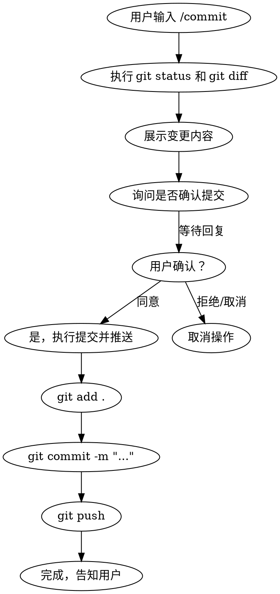

# 带确认的 Git 提交技能

## 概述

当用户输入 `/commit` 命令时，执行以下流程：展示变更 → 等待确认 → 提交 → 推送。整个过程需要用户明确同意后才能执行推送操作。

## 使用场景

- 用户输入 `/commit` 或 `/commit -m "提交信息"` 命令
- 功能开发完成，需要提交代码
- 需要在提交前展示变更内容供用户审核

## 执行流程



## 具体步骤

### 第一步：展示变更

当用户输入 `/commit` 时，首先执行：

```bash
# 查看未暂存的变更
git status

# 查看具体的变更内容
git diff

# 如果有暂存的内容，也显示出来
git diff --cached
```

将结果展示给用户，说明有哪些文件被修改、添加或删除。

### 第二步：等待确认

向用户展示以下内容：
- 变更的文件列表
- 主要的变更内容
- 询问是否确认提交

示例：
```
📝 变更摘要：
- modified: src/server.py
- modified: README.md
- added: new_feature.py

是否确认提交？（回复"是"或"同意"后执行提交和推送）
```

### 第三步：执行提交

用户确认后，执行：

```bash
# 添加所有变更
git add -A

# 执行提交（如果没有提供 -m 参数，会使用默认的提交信息）
git commit -m "功能更新：描述变更内容"

# 推送到远程
git push
```

### 第四步：反馈结果

提交完成后，告知用户：
- 提交成功
- 提交哈希
- 已推送到远程分支

## 提交信息规范

如果用户没有提供提交信息，使用以下格式：

```
feat: 新功能名称

- 变更点 1
- 变更点 2

Co-Authored-By: Claude Opus 4.6 <noreply@anthropic.com>
```

常用前缀：
- `feat:` 新功能
- `fix:` Bug 修复
- `refactor:` 代码重构
- `docs:` 文档更新
- `chore:` 构建过程或辅助工具变动

## 快速参考

| 操作 | 命令 |
|------|------|
| 触发提交流程 | `/commit` 或 `/commit -m "信息"` |
| 查看状态 | `git status` |
| 查看变更 | `git diff` |
| 确认提交 | 回复"是"或"同意" |
| 取消提交 | 回复"否"、"拒绝"或"取消" |

## 常见错误

1. **未展示变更就提交** - 必须先展示给用户审核
2. **用户未确认就提交** - 必须等待用户明确同意
3. **跳过 git push** - 确认后需要推送到远程
4. **忽略用户的拒绝** - 用户拒绝时立即取消操作

## 注意事项

- **未经用户同意，绝不执行 git push**
- 如果用户拒绝，立即取消并告知用户
- 如果没有变更需要提交，告知用户并取消操作
- 提交信息应该清晰描述变更内容